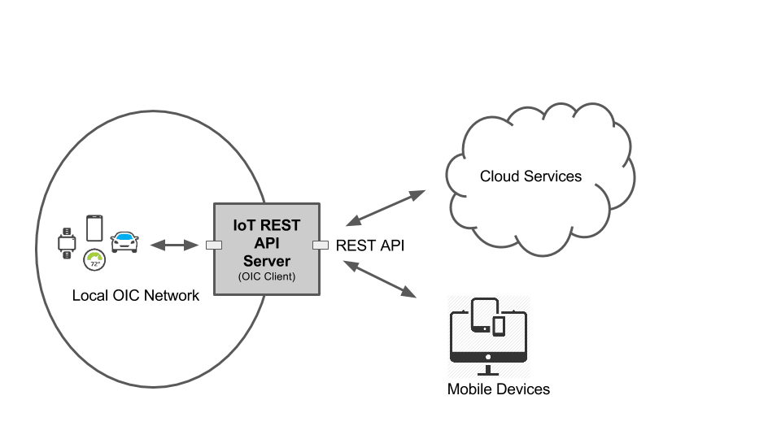

# IoT REST API Server
## Description
This project provides node.js based REST API server accoring to the  OIC (Open Interconnect) core specification. 

The project is experimental at the moment and APIs provided are work in progress and subject to changes.



## Install

```
npm install node-gyp -g
git clone https://github.com/01org/iot-rest-api-server.git
cd iot-rest-api-server
npm install
```


## Usage

Start the API server

```node index.js```

### Command Line Options

The command line options 

```
node index.js -h

Options

  -h, --help           
  -v, --verbose        
  -p, --port number    
  -s, --https          
  ```
#### verbose
More verbose logging
#### port 
Listen to specifc port. Default is 8000
#### https
Use https with TLS instead of plain http. In order to use https the `config` directory needs to contain the following certificate and private key files (in PEM format)

```
certificate.pem
private.key
```

You can use the `config/generate-key-and-cert.sh` to generate the files for testing only purposes. The certificate is self signed and browsers do not regognise it so you will get warnings. 

The recomemnded way to use the https is to get proper certificate from know certificate authority and corresponding private key and place those to the `config` directory.

## API End Points

/api/system

/api/apps

/api/install

/api/oic

## API documentation

The REST APIs are documented in the /doc folder using the [RAML](http://raml.org/) modeling language. You also need the ```raml2html```node module to produce the documentation:

```npm install -g raml2html```

The API documentation can be generated 

```raml2html doc/name-of-the-raml-file > api.html```

For example

 ```raml2html doc/oic.wk.res.raml > oic-res.html```

The ```.html``` file can be then opened by a browser. The ```.html```file contains the full documentation of the REST API including all the REST methods (GET, POST, DELETE, etc) supported, query parameters (like ?id=foo) and the JSON formats in each API.

## Examples

The following examples assumes your IoT OS enabled device runs on IP address: 192.168.0.1

Get the system status:

http://192.168.0.1:8000/api/system

Discover all the OIC enabled devices on the local network:

http://192.168.0.1:8000/api/oic/res

See the more detailed API documentation in the chapter above.

## Tests

The [test](https://github.com/01org/iot-rest-api-server/tree/master/test) directory contains the following small test utilities:

### oic-get

Send HTTP GET to ```/api/oic```endpoint. Environment variables API_SERVER_HOST and API_SERVER_PORT are used to construct the authority part of the URL.

````
export API_SERVER_HOST=10.211.55.3
# Discover
./test/oic-get /res
# Retrieve (href and di are from the discovery above)
./test/oic-get <href>?di=<di>
# Observe
./test/oic-get <href>?di=<di>&obs=1
```

### oic-put

Send HTTP PUT to ```/api/oic```endpoint. Environment variables API_SERVER_HOST and API_SERVER_PORT are used to construct the authority part of the URL. First parameter is ``ùri``` from the discover (```/res```) and second is JASON files with the properties that are being set.

````
API_SERVER_HOST=10.211.55.3
./test/oic-put  <href>?di=<di> <file-name-for-body>
```

### oic-api-tester

Performs the OIC discovery. On discovered resources performs a) GET or b) OBSERVE  operations

```
./test/oic-api-tester.js -?
./test/oic-api-tester.js -h 10.0.0.1 -p 8000 -o # start observing all found resources
```

## Tips

If you are running Chrome and want to see the JSON objects in nicely formated way, install the JSONView extension.

Another great tool for REST API development and testing is Postman, another Chrome extension.
